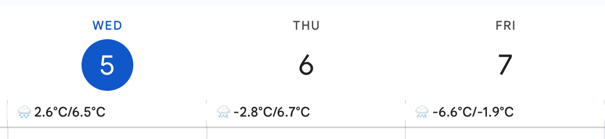

# Weather
## From a weather API to your calendar

Running with GitHub Actions, it checks the 7-day weather forecast every hour and then populates the corresponding events in an ICS file. This file is finally deployed with GitHub Pages, making it accessible from your favorite calendar app.

The used weather API provider is [Weatherbit](https://www.weatherbit.io/). It offers a free access to the 7-day forecast with some limits.

This one is configured to get the forecast for Longueuil, QC, Canada: [Calendar URL](https://tentacularideas.github.io/weather/weather.ics).

## Interested in using it?

- Fork this project in your own GitHub account;
- Enable GitHub Pages to be uploaded from GitHub Actions;
- Register an account on Weatherbit and get your API key;
- Set up a `production` environment:
  - Configure the `API_KEY` secret with your Weatherbit API key;
  - Configure the `LATITUDE` and `LONGITUDE` environment variables to the location you want the forecast for.
- Either wait for the first run or run it manually;
- Register the external calendar from your own URL `https://<account>.github.io/<repository>/weather.ics`.
